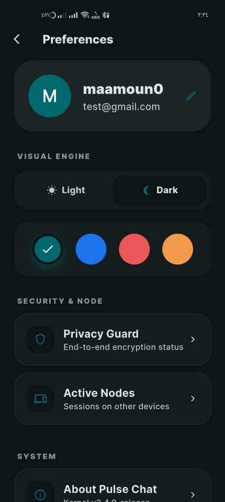
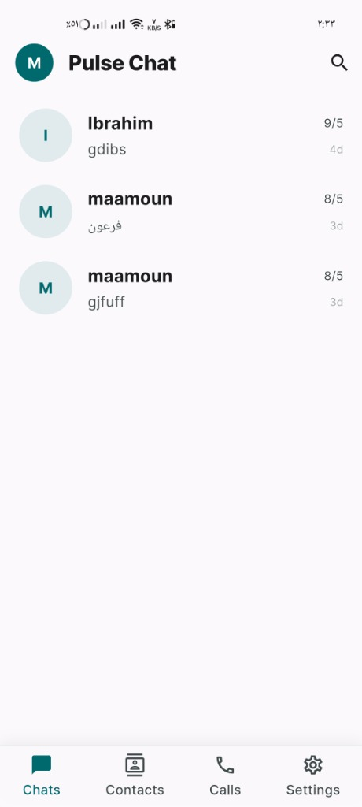
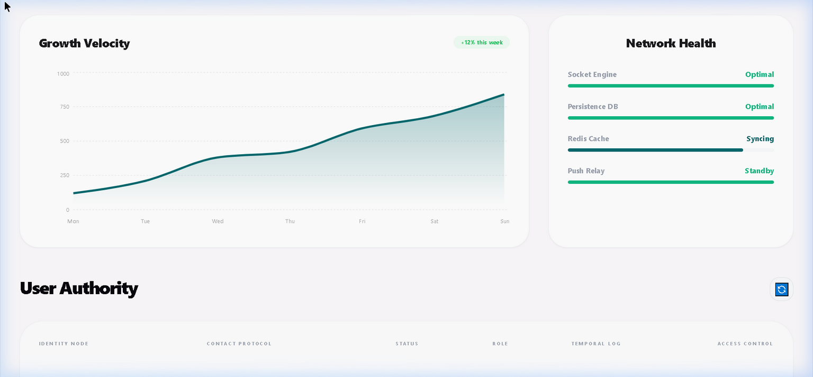
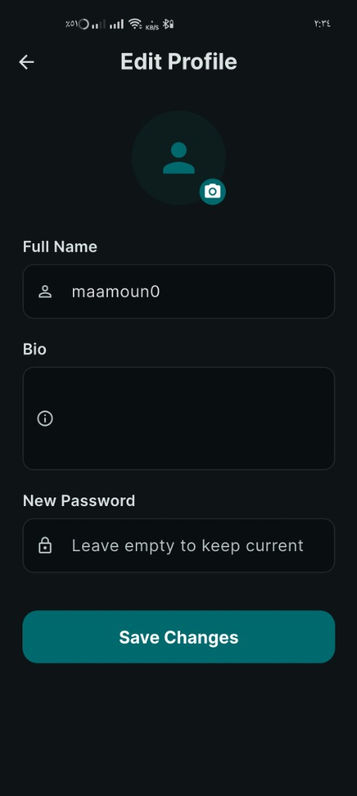
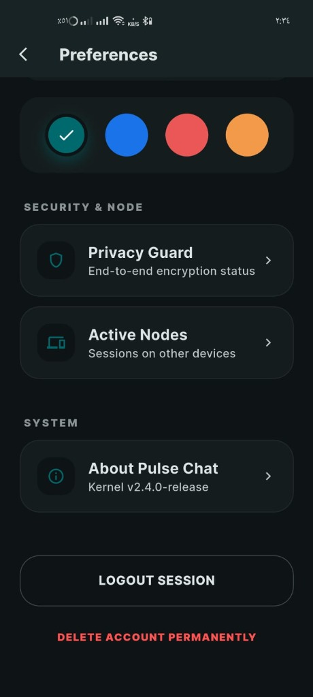
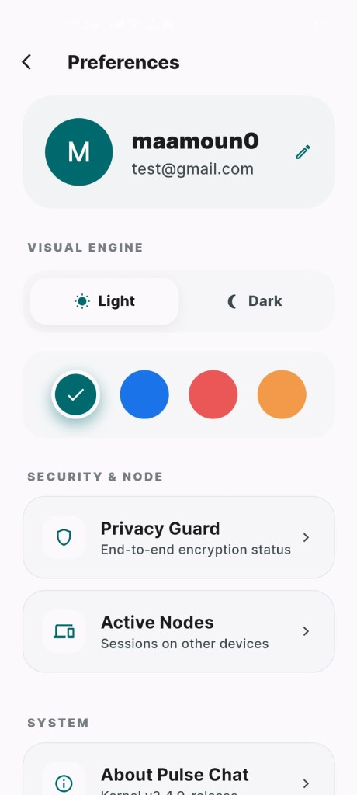
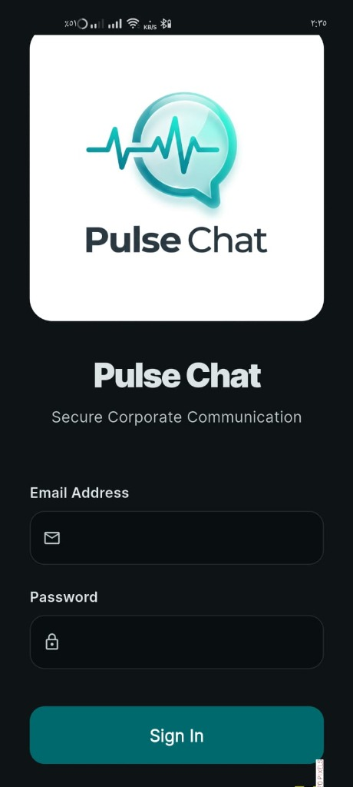
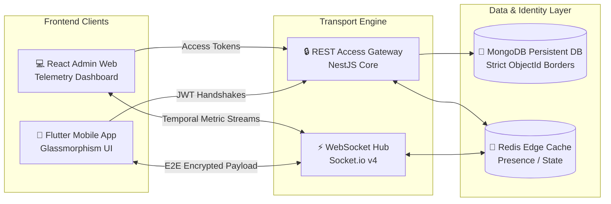
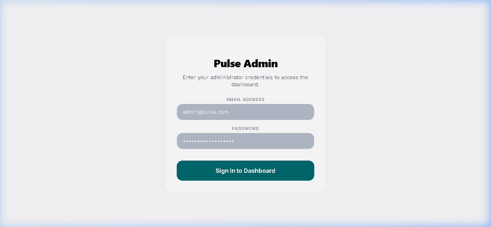
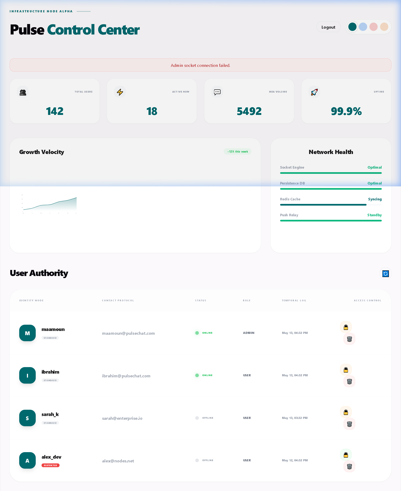

<div align="center">

# 🌐 Pulse Chat Platform
### **Enterprise-Grade Real-Time Secure Messaging Infrastructure**

[](https://flutter.dev)
[](https://nestjs.com)
[](https://mongodb.com)
[](https://socket.io)

*A state-of-the-art secure chat ecosystem featuring end-to-end encrypted message pipelines, an elegant Glassmorphism mobile interface, persistent offline-first synchronization, and a robust administrative telemetry hub.*

---

 &nbsp;&nbsp;  &nbsp;&nbsp; 

</div>

---

## ✨ Executive Summary

**Pulse Chat** represents a masterfully engineered communication suite tailored for uncompromised security, cross-device session synchronization, and instantaneous presence tracking. Utilizing an advanced, decoupled micro-architecture, the platform ensures that strict multitenant identity borders isolate user conversations natively at the persistence layer.

> [!IMPORTANT]
> **Live Showcase Included:** This public showcase repository provides the official executable **Android package (`.apk`)** attached directly inside the GitHub Releases section alongside official real system screen captures.

---

## 📸 High-Fidelity UI Portfolio Showcase

Explore the exquisite user experience verified on real mobile target devices:

````carousel

<!-- slide -->

<!-- slide -->

<!-- slide -->

<!-- slide -->

<!-- slide -->

<!-- slide -->

````

---

## 🚀 Try the Live Build (Android)

Experience the premium aesthetics and blazingly fast Socket engine directly on your mobile device:

1. **Download the Package:** Get the official Android APK directly from the **Releases** page of this repository.
2. **Install:** Authorize installation from external sources if prompted by Android Security.
3. **Register/Login:** Create a free standard identity node using a unique handle and connect instantly to the global real-time cloud server.

---

## 🎨 System Architecture & Telemetry Pipeline



---

## 💎 Premium Design System & UI Architecture

The application design leverages bespoke curated color standards tailored to evoke trust, technical prestige, and visual relaxation.

### **Core Aesthetic Pillars:**
* **Frosted Glassmorphism:** Ambient visual blurring (`BackdropFilter`) layered over deep space surfaces with multi-stop micro-gradients.
* **Curated Premium Palette:** Tailored primary variants centered around deep corporate Teal (`#00696E`), neon pulse accents (`#75F5FD`), and pristine dark environments (`#0A192F`).
* **Visual Engine Preferences:** Instantly reactive UI mode bindings switching seamlessly between ambient high-contrast Light themes and optimized AMOLED Dark backdrops.

---

## 🖥️ Pulse Control Center (Admin Dashboard Telemetry)

As an enterprise-grade solution, the platform incorporates a dedicated web portal serving as a high-fidelity control station. Built with premium layout principles, multi-stop teal gradient graphics, and real presence metric streaming, the live dashboard facilitates continuous monitoring of node infrastructure:

### **Secure Portal Authentication Interface**


### **Fully Populated Telemetry Control Station**


---

## 📂 Repository Showcase Structure

```text
pulse-chat-platform/
├── README.md                       # Comprehensive Platform Overview
├── screenshots/                    # Real Application UI Imagery
│   ├── app_login.jpg               # Glassmorphism Authentication UI
│   ├── app_register.jpg            # Account Provisioning Setup
│   ├── app_chats_list.jpg          # Active Conversation Threads
│   ├── app_preferences_dark.jpg    # Deep AMOLED Preferences
│   ├── app_preferences_light.jpg   # High-Contrast Ambient View
│   ├── app_security.jpg            # Privacy Cryptography Guard
│   ├── admin_login.png             # Authentic Admin Website Portal Sign-In UI
│   ├── admin_dashboard.png         # Telemetry Dashboard Header View Excerpt
│   └── admin_dashboard_full.png    # Telemetry Dashboard Website Top-to-Bottom Capture
└── showcase-code-samples/          # Curated Excerpts Demonstrating Premium Code Quality
    ├── login_screen.dart           # Flutter Frontend UI Showcase
    ├── Dashboard.tsx               # React Admin Telemetry Control UI
    └── chats.service.ts            # NestJS Backend Data Deduplication Engine
```

---

## 💻 Curated Source Samples

To preserve intellectual property and secure production authentication configurations, this directory showcases selected non-sensitive frontend UI blueprints and optimized database transaction snippets demonstrating robust software patterns:

* **Frontend UI Clean Code:** View the exquisite Flutter UI structure implementing backdrop blur layers and custom text formatting inside **`showcase-code-samples/login_screen.dart`**.

* 
* **React Dashboard Hooks:** Explore optimized socket connections mapping presence graphs via Recharts inside **`showcase-code-samples/Dashboard.tsx`**.
* **Thread Normalization:** See the intelligent array deduplication and active timestamp sorting algorithm powering multitenant access inside **`showcase-code-samples/chats.service.ts`**.

---

## 📜 Legal & Licensing


---
Created by Ahmed Maamoun

Created as an advanced production portfolio piece demonstrating clean enterprise development standards. All displayed logo graphics, interface palettes, and internal code assets are fully protected intellectual property.
